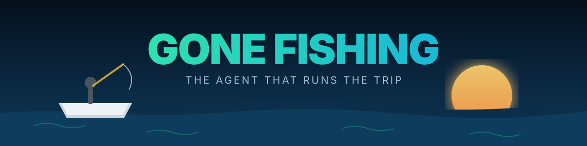
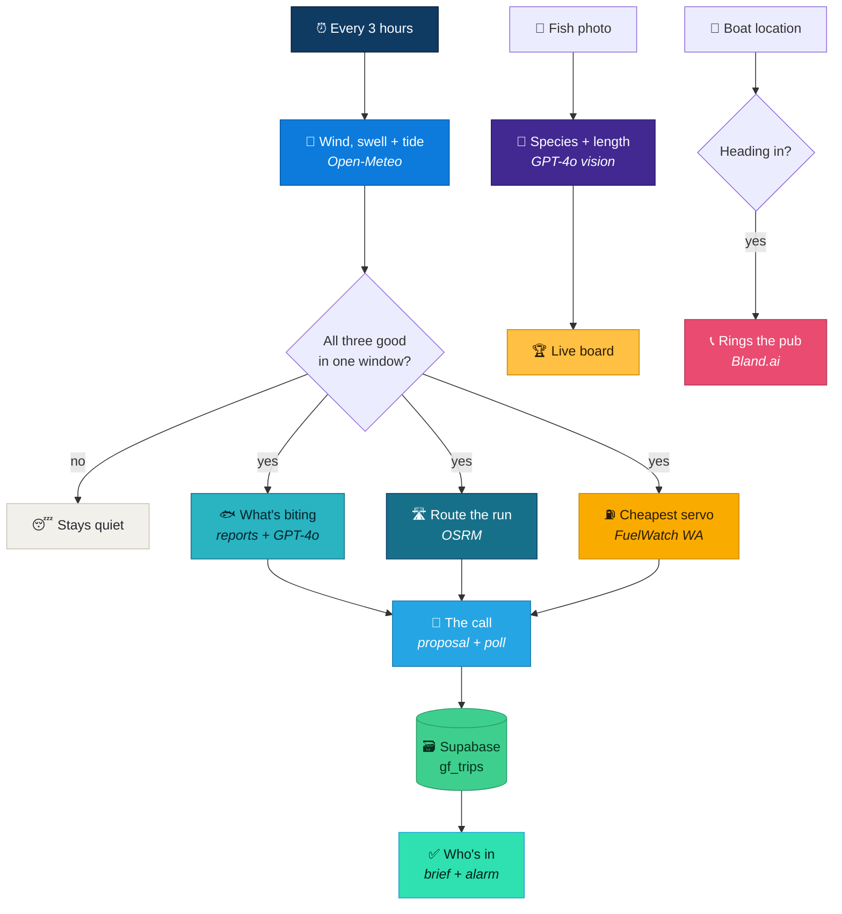

<p align="center">
  
</p>

<p align="center">
  <b>Davo watches the wind, swell and tide. The moment all three line up he works out<br>
  what's biting, prices the run, gets the boys out of bed, and puts every fish on a board<br>
  nobody can lie to. Then he rings the pub on the way in.</b>
</p>

<p align="center">
  
  
  
  
  
  
</p>

---

Every three hours Davo reads the real marine forecast. When he finds **light offshore
wind, swell under a metre, and a tide that is actually running** — all three inside the
same daylight window — he scans the fishing reports for what's on, routes the drive,
finds the genuinely cheapest servo on the way, and drops the whole thing in the group
chat with a poll.

Tap **I'm in** and you get your own brief: alarm, wheels-up, target species, your share
of the fuel, and what to bring. Photograph a fish and it's identified, measured and on
the leaderboard before you've re-baited. When the boat turns for home, the pub gets a
phone call.

This is what lands in the chat. A real run, straight off the live forecast:

```
🎣 GONE FISHING — the window just opened

🌬 Forecast: 4kn E, 0.2m, glassy
🚤 Launch: 8:00am off the ramp · wheels 6:28am
🐟 Biting: Spanish mackerel · the shoals
⛽ Fuel: $2.33/L at Dunning's Karratha (24c under)
🛒 Stop: bait $9.90 · ice $16.50 · pie 4.8★
💰 Split: $10 each · 56.7km
🏆 Board: live leaderboard

👇 Boys — Tue 22 Sep. You in?
```



---

## Two workflows

One canvas carries the lot — four lanes, several triggers. n8n is fine with that, and it
means the whole system is a single import.

| | File | Lanes |
|---|---|---|
| 🎣 | `workflows/gone-fishing.json` | **The build.** Forecast + the call · who's in · heading in · the board |
| 🎬 | `workflows/gone-fishing-FILMING.json` | Same workflow, pointed at a coast that is genuinely ON today. Hit **Run it now** and it goes end to end |

**The four lanes:**

| Lane | Trigger | What happens |
|---|---|---|
| 🌊 The call | Every 3 hrs + manual | Forecast, gate, what's biting, route, cheapest fuel, proposal + poll. Writes the trip as `proposed` |
| ✅ Who's in | Webhook | Poll answers. Everyone who taps in gets their own brief and a calendar alarm. Trip flips to `locked` |
| 🍺 Heading in | Webhook | Boat location. Inside 8 km of the ramp and closing, the pub gets a real phone call |
| 🏆 The board | Webhook | Fish photo in, species and length out, straight onto the leaderboard |

### Why the demo build has no fake data in it

The obvious way to demo this is to hard-code a perfect forecast. That's a lie, and it
looks like one on camera.

Instead the filming workflow is the **same workflow with different coordinates**.
Somewhere in Western Australia it is always on, so it runs against the live API and fires
for real. Today that's Karratha: 4 kn easterly, 0.2 m swell, 0.36 m of tide through the
window. Change two numbers in the settings node and it's your coast.

---

## What makes it "on"

All four, in the same daylight window, or Davo says nothing:

| Condition | Gate | Why |
|---|---|---|
| Wind speed | ≤ 11 kn | Above that it's sloppy and wet |
| Wind direction | 45°–135° | Easterly, so offshore on a west-facing coast |
| Swell | ≤ 1.0 m | You can launch and anchor |
| Tide movement | ≥ 0.15 m across the window | Fish feed on a running tide |
| Duration | ≥ 4 hours | Not worth the drive for one |

> **On that tide gate.** Perth is microtidal. Measured against the live feed the whole
> week only swings about **0.48 m**, and a four-hour window sees 0.12–0.25 m of it. A
> 0.35 m gate sounds sensible and can literally never fire there. Check the number
> against your own coast before you copy it.

---

## What's real, and the workarounds where it can't be

Most automation demos quietly aren't. Here's the honest split.

**Genuinely real, no key required:**
- **Wind, swell and tide** — [Open-Meteo](https://open-meteo.com). The marine endpoint
  returns `sea_level_height_msl`, which *is* the tide, not a model of one.
- **The drive** — [OSRM](https://project-osrm.org) public router. Real roads, real time.
- **Cheapest fuel** — [FuelWatch WA](https://www.fuelwatch.wa.gov.au), a real state
  government API: 946 stations with today's price and a lat/long on every one. The
  workflow filters to the driving corridor and takes the cheapest. Nothing is hard-coded.

**Real, needs your own key:**
- **Species and length** — GPT-4o vision. Verified on a real photo:
  `{"species":"sardine","length_cm":15,"confidence":0.9}` for about **US$0.0025** a call.
- **What's biting** — no fishing-report API exists anywhere. It fetches a real reports
  page and has GPT-4o-mini pull out the species and the ground. It falls back to a
  generic spot rather than stopping the trip.

**No API exists, so here's the workaround:**
- **"Tracks the boys on Find My"** — Apple exposes **no** Find My API and has said it
  won't. The workaround is [OwnTracks](https://owntracks.org) in HTTP mode (free, open
  source) or a two-line iOS Shortcut that POSTs `{lat, lon}` to the webhook. Either takes
  about five minutes and is genuinely live location.
- **"Sets their alarm"** — you cannot write to someone else's phone alarm from a server.
  A calendar event with an alert does the same job and needs nothing installed.
- **"Books the pub and lines up a round"** — there is no consumer booking API in
  Australia. A real phone call is placed with [Bland.ai](https://bland.ai). That's still
  automation. It's just voice, because voice is the only interface a pub exposes.

---

## The board

`board/` is the leaderboard: a lander, a signup and a live board, on Vercel + Supabase.

**It's public, so:**
- Every table has **RLS on with no policies**. The anon key can do nothing at all; the
  service role key never leaves the server.
- The browser only ever talks to `/api/*` and never holds a database key.
- `/api/catch` is machine-only behind a **shared secret**, so nobody can post themselves
  a 90 cm mulloway.
- Signups are rate-limited per IP and globally, IPs are stored **hashed**, every field is
  length-capped, and photos are type- and size-checked.
- Photos are squared and downscaled **in the browser**, so a 4 MB phone photo lands as
  about 40 KB.

---

## Running it

1. **Import both workflows** into n8n.
2. **Swap the placeholders.** Every secret here reads `YOUR_TELEGRAM_BOT_TOKEN`,
   `YOUR_OPENAI_API_KEY`, `YOUR_TELEGRAM_CHAT_ID` and so on. Nothing real ships in this repo.
3. **Edit one node.** `Davo settings` holds the crew, the ramp, the gates
   and the bring-list. Nothing downstream needs touching.
4. **Deploy the board** (optional):

```bash
cd board
psql "$SUPABASE_CONNECTION" -f schema.sql
# set GF_SUPABASE_URL, GF_SUPABASE_SERVICE_KEY, GF_INGEST_SECRET
vercel deploy --prod
```

5. **Open the FILMING workflow and hit Run it now** to watch it fire on a live
   forecast without waiting for weather.

---

<p align="center"><sub>MIT. Built by <a href="https://myceliumai.com.au">Mycelium AI</a>. Go catch something.</sub></p>

---

**Built by [Mycelium AI](https://www.myceliumai.com.au)**, a Perth agency that builds websites, runs Google and Meta ads, and automates the admin for small businesses. Follow the builds on Instagram at [@aaronautomates](https://www.instagram.com/aaronautomates/).
